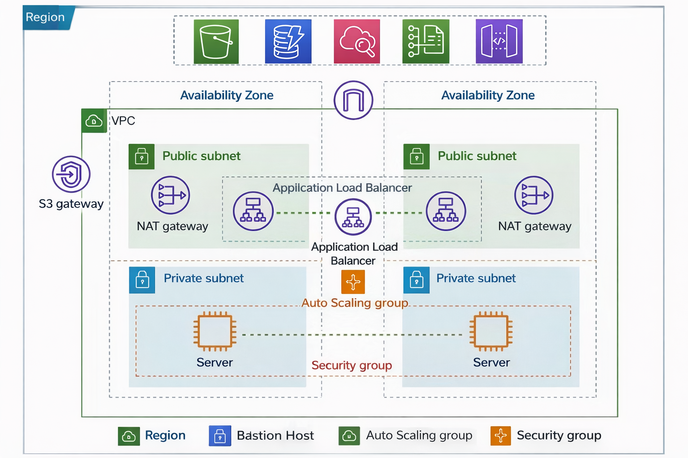

# 🚀 AWS VPC Architecture – Learning Project

### Secure Private Subnet Website Hosting Using Bastion Host

This project demonstrates a **real-world AWS VPC architecture** where a website is hosted on **EC2 instances inside a private subnet**, following **cloud security best practices**.

The architecture uses a **Bastion Host (Jump Server)** for secure administrative access and an **Application Load Balancer (ALB)** for public traffic, closely matching **production-grade AWS environments**.

---

## 📌 Project Objective

The main objectives of this project are to understand:

* Hosting applications inside a **private subnet**
* Securely accessing private EC2 instances
* The importance of a **Bastion Host**
* Real-world usage of **SSH and SCP**
* End-to-end deployment flow used by cloud engineers

This approach reflects **enterprise-level AWS architecture design**.

---

## 🧱 Architecture Overview



### Key Components

* Custom Amazon VPC
* Public and Private Subnets
* Internet Gateway
* NAT Gateway
* Bastion Host (Jump Server)
* Application Load Balancer (ALB)
* EC2 Instances (Private Subnet)
* Security Groups
* Multi-AZ High Availability

---

## 🌐 Why the Website Is Hosted in a Private Subnet

In real-world AWS environments:

* Application servers **should not be exposed directly** to the internet
* Direct SSH or HTTP access to EC2 instances is avoided
* Only controlled entry points are allowed

### Benefits

* Improved security
* Reduced attack surface
* Better compliance with cloud best practices

### In This Project

* Website runs on **private EC2 instances**
* Users access the application **only via ALB**
* Administrative access is done **only through Bastion Host**

---

## 🧑‍🚀 Bastion Host (Jump Server)

A **Bastion Host** is an EC2 instance placed in a **public subnet** that acts as a secure gateway to access private EC2 instances.

### Why a Bastion Host Is Required

* Private EC2 instances have **no public IP**
* Direct SSH access from the internet is blocked
* Provides **controlled and auditable access**

### Bastion Host Configuration

* Deployed in Public Subnet
* Assigned a Public IP
* SSH access allowed **only from trusted IPs**

---

## 🔐 Security Group Design

### Bastion Host Security Group

**Inbound Rules**

* SSH (22) → Allowed from *my IP only*

**Outbound Rules**

* All traffic allowed

### Private EC2 Security Group

**Inbound Rules**

* SSH (22) → Allowed only from Bastion Host SG
* HTTP (80) → Allowed only from ALB SG

**Outbound Rules**

* Internet access via NAT Gateway

✅ This ensures **zero direct internet access** to private servers.

---

## 🖥 Website Hosting on Private EC2

### Step 1: SSH into Bastion Host

```bash
ssh -i mykey.pem ec2-user@<BASTION_PUBLIC_IP>
```

### Step 2: SSH into Private EC2 from Bastion

```bash
ssh -i mykey.pem ec2-user@<PRIVATE_EC2_PRIVATE_IP>
```

---

## 📦 Website Deployment Using SCP

### Copy Website from Local Machine to Bastion Host

```bash
scp -i mykey.pem -r website/ ec2-user@<BASTION_PUBLIC_IP>:/home/ec2-user/
```

### Copy Website from Bastion Host to Private EC2

```bash
scp -i mykey.pem -r website/ ec2-user@<PRIVATE_EC2_PRIVATE_IP>:/home/ec2-user/
```

This **two-step SCP workflow** is commonly used in secure cloud environments.

---

## 🌐 Install Web Server on Private EC2

```bash
sudo yum update -y
sudo yum install httpd -y
sudo systemctl start httpd
sudo systemctl enable httpd
```

---

## 📁 Deploy Website Files

```bash
sudo cp -r website/* /var/www/html/
sudo chown -R apache:apache /var/www/html/
```

The website is now running on **private EC2**, but remains **hidden from direct internet access**.

---

## ⚖️ Access via Application Load Balancer

* ALB is deployed in the **public subnet**
* ALB forwards HTTP traffic to **private EC2 instances**
* Users access the website using **ALB DNS name**
* Private EC2 remains secure and isolated

---

## 🔄 Complete Traffic Flow

### User Traffic

```
User → Application Load Balancer → Private EC2 → ALB → User
```

### Administrative Access

```
Local Machine → Bastion Host → Private EC2
```

---

## 🌱 Learning Outcomes

Through this project, I gained hands-on experience with:

* AWS VPC design and networking
* Private subnet application hosting
* Bastion Host access patterns
* Secure SSH and SCP workflows
* Production-style AWS architecture

---

## 🚀 Future Enhancements

* Auto Scaling Group for EC2 instances
* HTTPS using AWS ACM
* CI/CD deployment using GitHub Actions
* Monitoring and logging with Amazon CloudWatch

---

## 📌 Disclaimer

This is a **learning and practice project** created to understand AWS networking and secure deployment concepts.
No production workloads are hosted.
